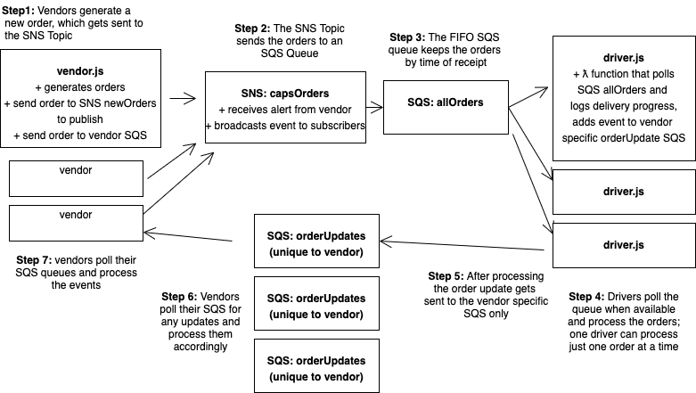
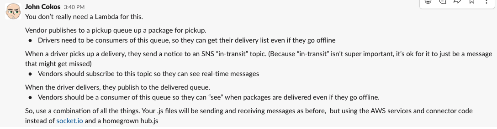
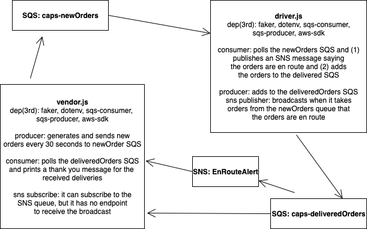
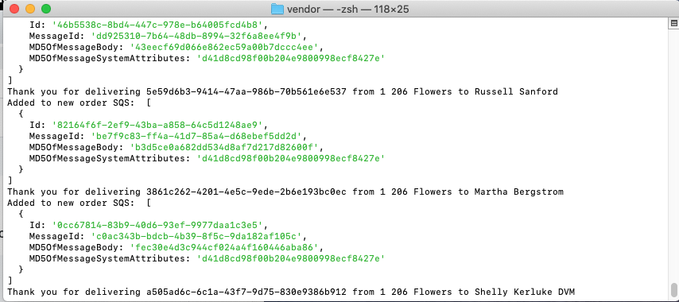
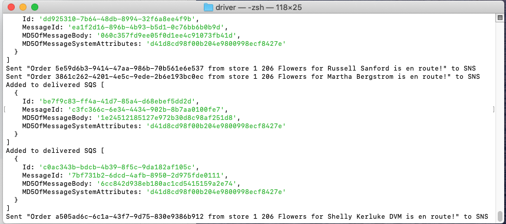

# aws-caps
An event driven package delivery system notification service hosted on AWS and using SNS, SQS and Lambda serverless functions

## Project planning

Initially, I read the lab instructions and imagined the app to be structured like this:

Conceptually that was a little difficult for me, so I asked John who gave me the following instructions:

So I revised the plan to make the following:

## Demonstration of System

This implementation works as follows

1. **vendor.js** app starts and sends messages off to the new order SQS
2. **driver.js** polls the new order SQS and processes orders when available
3. When drivers take an order, they publish an alert to the en Route SNS
4. Vendors are listening for this, but I didn't have a protocol to receive the message (it isn't an email, sms, etc. it's just a node app)
5. When drivers take an order, it is removed from the new orders queue and added to the delivered orders queue
6. Drivers log a message that the order has been delivered
7. Vendors poll the delivered orders SQS and they print a thank you message when they receive delivered order objects

Here is a sample of the running **VENDOR** app

Here is a sample of the running **DRIVER** app

## Improvements

In getting a few pieces starting to come together here, I think I have a better idea of how to structure apps using different AWS pieces. When I have time I will go back and implement a more meaningful version of this project.
