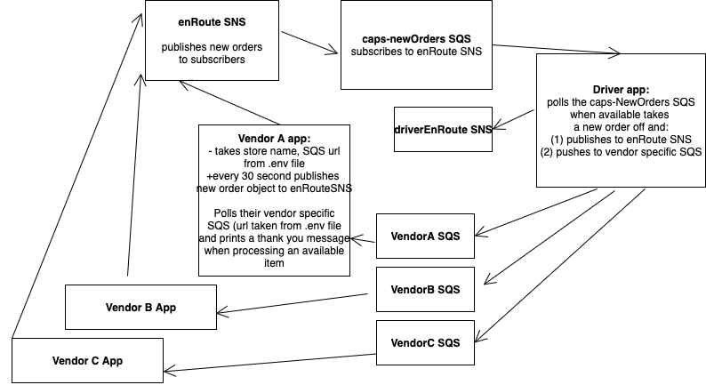
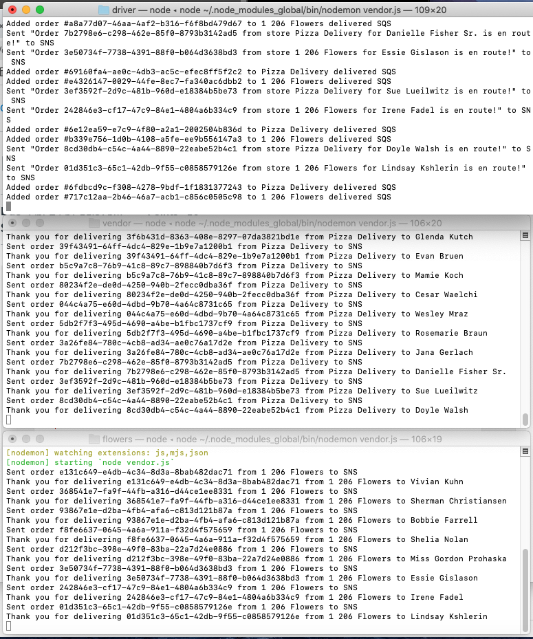

# aws-caps
An event driven package delivery system notification service hosted on AWS and using SNS, SQS and locally hosted node.js apps

## Project planning 

You can check out [my first iteration of this project here.](README-old.md)

## UML Diagram 



## Demonstration of system

This implementation works as follows:

1. **vendor.js** app starts and sends new messages off to the caps-enRoute SNS; Note that vendors have .env variables ```STORE_NAME```, that will fill in the name of the store and ```STORE_URL``` that provides the store specific SQS locator. This means the code can be exactly copied and used for infinite vendors. In the example I made a flower shop and a pizza delivery, but they are the identical code with different .env files 
2. The **caps-enRoute SNS** sends out a message when it receives a new order 
3. The **caps-newOrders SQS** subscribes to this message and enqueues the new orders 
4. The **driver.js** app (and you could copy and make as many of them as needed as workers) polls the **caps-newOrders SQS** and processes new orders when it is available 
5. After 10 seconds the **driver.js** app publishes to the **caps-driverEnRoute SNS**
6. After 20 seconds the **driver.js** app takes the queueUrl off the order object and sends the order item to the delivered SQS that corresponds to the vendor it came from
7. The **vendors** poll their SQS queues and print a thank you message when they have delivered objects to process

## Proof of Life 


